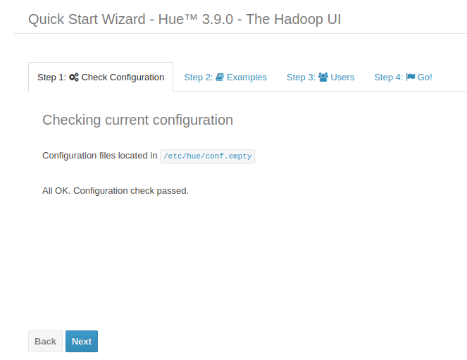
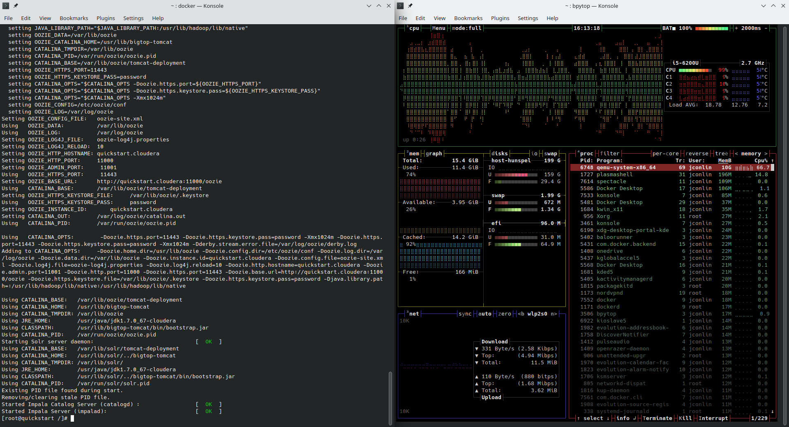

# Week 2/22/23 to 3/1/23
## 2/26
On this day I worked on re-doing the install on my system
Modifications done to Docker system resources including increasing ram, cpu cores, and capping the max amount of storage used
After a clean install the Cloudera Docker image starting acting as anticipated
    
Here is an excerpt of the performance that I was getting pre modifications

