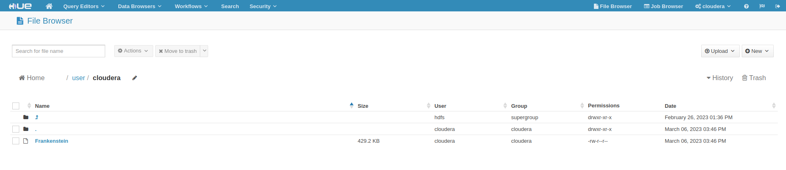
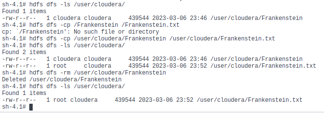
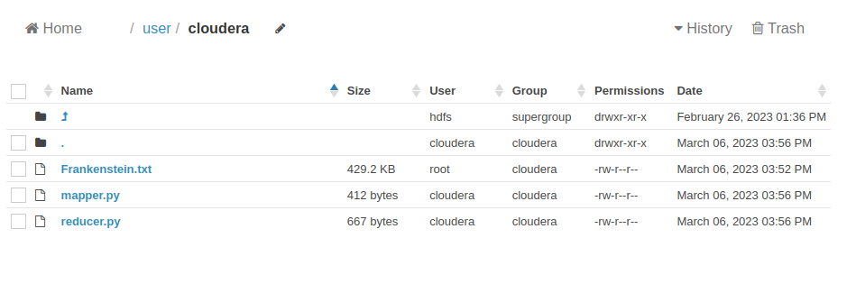

# Biweekly 2/22/23 to 3/6/23
## 2/26
On this day I worked on re-doing the install on my system
Modifications done to Docker system resources including increasing ram, cpu cores, and capping the max amount of storage used
After a clean install the Cloudera Docker image starting acting as anticipated
    
Here is an excerpt of the performance that I was getting pre modifications
  
## 2/28-3/5
There was a slight stoppage in working on this Docker image.    
I have continually faced constraints since I am working on my 8ish year old laptop.  
To attempt to determine what issues are because of my computer and which ones are the Docker image I decided to setup a VM on my Desktop with considerable more resources.  
This took 3 days after Docker not working led me down a rabbit hole to troubleshoot.  
I ended up realizing that docker requires virtualization, so I needed to enable nested virtualization in-order to properly run docker.  
I was able to conclude that the system on my laptop is mostly to fault other than one service that runs a db in the background might not run optimally.  
## 3/6-3/7  
On this day after taking a break and reviewing some SQL I started working on learning MapReduce.  
I watched some videos including one by an amazing professor who does great work with Genomic Data Analysis and Web Scraping. This increased my overall comprehension of Map Reduce.  
I then decided to use an example supplied to me that would count the amount of words and each occurence. This would demonstrate the Mapping out as it would be split across multiple nodes in the cluster, and the reducer where it takes the output of each mapper and reduces it to a reasonable result.
I imported frankenstein the book which looked like this.  
  
I also renamed it as a txt file for good practice and did this inside of the docker instead of using Hue.  
  
I then imported the mapping and reducing python scripts that would work with hadoop.  
  
Here is the link to the Mapper and Reduce script provided by Dr.Dancik
[Mapper](https://github.com/fastasjamesschool/DataScienceResearch/blob/main/WeeklyUpdates/2-22to3-6/wordcount/)  
This is where I hit a wall. 

I spent alot of time working on this trying to determine where I had gone wrong. I tried a default test file that ran through fine so it wasn't the mapper or reducer, but something with the encoding on the text file.
Eventually I pulled Dr.Dancik in to help me determine what was wrong with the file.
I was feeding the system the Frankenstein text from Guttenberg press which said it was utf-8 encoded. The file although it told the system it was utf-8 it had characters that were not utf-8. So to fix this we sorted through found all of the special characters, and altered them to properly categorize the words.  
This worked and output this file
[Output](https://github.com/fastasjamesschool/DataScienceResearch/blob/main/WeeklyUpdates/2-22to3-6/wordcount/part-00000)
Now that it works I will explain what happens here
This is a general explanation of MapReduce
The hadoop streaming jar will split the job up and use the mapper.py to count the amount of times each word occured, per the part of the text it was fed. Reducer then merges all of the words and counts the amount of occurences.  
Bloopers for the week  
The docker container stoped responding to console commands so from this point onwards I used the terminal integrated with the docker desktop application.  
Konsole  
  
Docker Desktop Terminal  

