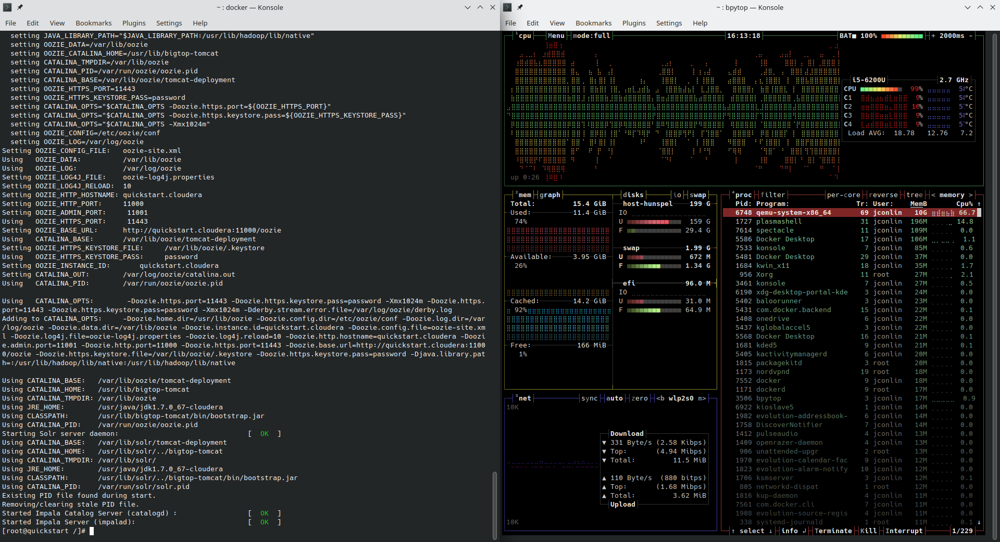

# Weeks 2/22/23 to 3/6/23
## 2/26
On this day I worked on re-doing the install on my system
Modifications done to Docker system resources including increasing ram, cpu cores, and capping the max amount of storage used
After a clean install the Cloudera Docker image starting acting as anticipated
    
Here is an excerpt of the performance that I was getting pre modifications
  
## 2/28-3/5
There was a slight stoppage in working on this Docker image.    
I have continually faced constraints since I am working on my 8ish year old laptop.  
To attempt to determine what issues are because of my computer and which ones are the Docker image I decided to setup a VM on my Desktop with considerable more resources.  
This took 3 days after Docker not working led me down a rabbit hole to troubleshoot.  
I ended up realizing that docker requires virtualization, so I needed to enable nested virtualization in-order to properly run docker.  
I was able to conclude that the system on my laptop is mostly to fault other than one service that runs a db in the background might not run optimally.  

## 3/6
On this day after taking a break and reviewing some SQL I started working on learning MapReduce.  
I watched some videos including one by an amazing professor who does great work with Genomic Data Analysis and Web Scraping. This increased my overall comprehension of Map Reduce.  
Bloopers for the week  
The docker container stoped responding to console commands so from this point onwards I used the terminal integrated with the docker desktop application  
Konsole  
  
Docker Desktop Terminal  
