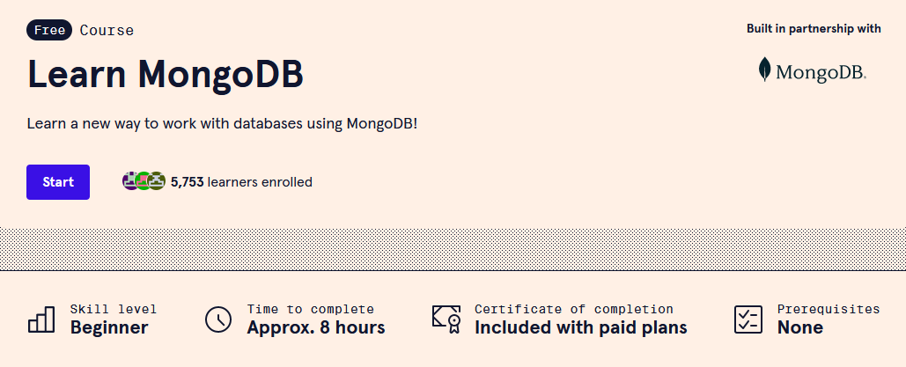

# Biweekly 3/22/23 to 4/12/23
## 3/29/23 - 4/1/23
On this day I started to work on utilizing the DB that had been setup.  
This process involved finding some utility out of this DB.
Projects I considered included web scraping a webpage and inserting what I find into the DB, but I determined this would be too complex and take more time than available.  
I decided to take things one step at a time by messing around with MongoDB to see what I was capable of doing, and what I still needed to learn. I attached the files where I created a collection
[Work](https://fastasjamesschool.github.io/DataScienceResearch/WeeklyUpdates/3-22to4-12/README.md)  
## Create a new database.
use(database);  
## Create a new collection.
db.createCollection(collection);  
## Create an object for this collection
db.collection.insert({  
    title: "Testing 1",  
    description: "This is test number 1 for Mongo",  
    submitted: "This is a test",  
    tags: ['This', 'is', 'a', 'test']  
})
## Create multiple objects for this collection
db.collection.insertMany([{  
    title: "Testing 2",  
    description: "This is test number 2 for Mongo",  
    submitted: "This is a test",  
    tags: ['This', 'is', 'a', 'test']  
},  
{  
    title: "Testing 3",  
    description: "This is test number 3 for Mongo",  
    submitted: "This is a test",  
    tags: ['This', 'is', 'a', 'test']  
},  
{  
    title: "Testing 4",  
    description: "This is test number 4 for Mongo",  
    submitted: "This is a test",  
    tags: ['This', 'is', 'a', 'test']  
}])

## Search for all objects in this collection

db.collection.find()

## Search for one object in this collection

db.collection.findOne()

## Search for objects meeting certain criteria

db.collection.find( {title: "Testing 1"})

## 4/1/23 - 4/12/23
After starting to learn how to use NoSQL by reading documentation, I decided to start taking a course to learn it instead of reading the documentation like I have been. Below I have added the new commands I've learned along with an explanation. After this is done, I will create a full cheatsheet attached to a link here.  
I chose to use Code Academy considering that I have learned most languages at a basic level from Code Academy before seeking out a more advanced learning tool

## DB Commands
## Database currently being used
db
## Databases available
show dbs
## Switch Database
use (target_DB)
